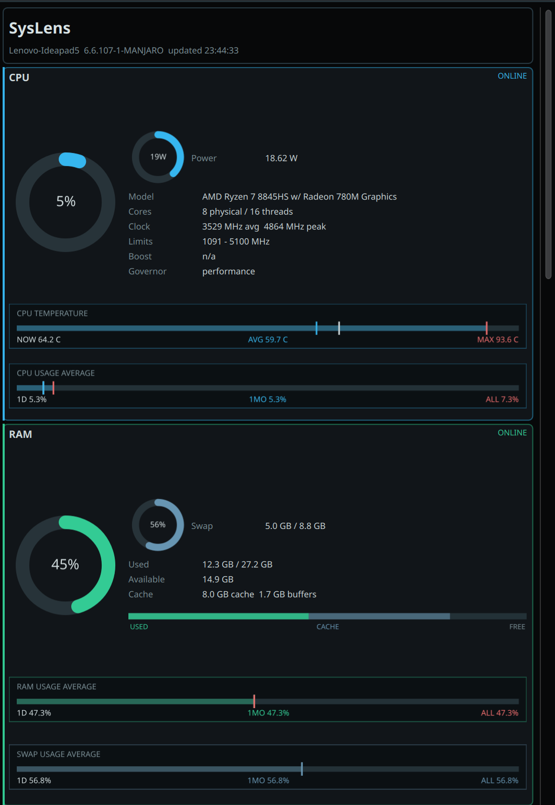

# SysLens

A dark, futuristic system monitor widget for **KDE Plasma 6**. Displays real-time CPU, RAM, GPU, Disk, Network, Battery and Process data in a compact, fully configurable panel popup.


---

## Screenshots

<p align="center">
  
  
</p>
<p align="center">
  
</p>

---

## Features

### Sections
| Section | Highlights |
|---------|-----------|
| **CPU** | Usage donut · power gauge (session-relative) · temperature bar · usage average bar |
| **RAM** | Usage donut · stacked used/cache/free breakdown bar · RAM & Swap average bars |
| **GPU** | Usage donut · VRAM secondary gauge · GPU & VRAM average bars |
| **Disk** | Usage donut · Read/Write I/O line chart |
| **Network** | Live ↓/↑ speed donuts · period traffic tiles · traffic line chart · Download & Upload average bars |
| **Battery** | Charge donut · power · energy · health · cycle count · time remaining |
| **Processes** | Top processes by CPU with RSS memory |

### Charts & Visualisations
- **MarkerSummaryBar** — horizontal bar with 3 period markers (short / long / all-time), across CPU, RAM, Swap, GPU, VRAM, and Network
- **LineChart** — scrolling time-series for CPU history, Disk I/O, and Network throughput
- **DonutChart** — arc gauge for all primary and secondary metrics
- **RamBreakdownBar** — segmented horizontal bar: Used | Cache | Free

### Configuration
Everything is tunable from **right-click → Configure**:

- Update interval (1 – 10 s)
- Process list length
- Per-metric average window periods (short & long, independently for RAM, Swap, GPU, VRAM, Net ↓, Net ↑)
- Section visibility toggles

### Design
- Each section has its own **identity colour** — CPU blue, RAM emerald, GPU purple, Disk gold, Network teal, Processes orange, Battery lime
- Secondary elements share a consistent neutral steel-blue
- Dark `#11161a` background designed to blend into any dark KDE theme
- Uniform donut sizing, margin, and spacing grid across all sections

---

## Requirements

| Dependency | Version |
|-----------|---------|
| KDE Plasma | 6.x |
| `kpackagetool6` | ships with Plasma 6 |
| Python | 3.9+ |

No third-party Python packages are required — the backend reads directly from `/proc` and `/sys`.

---

## Installation

```bash
git clone https://github.com/radoslavchobanov/syslens.git
cd syslens
bash scripts/install-plasmoid.sh
```

Then **right-click your panel → Add Widgets → search "SysLens"** and place it on your panel or desktop.

To upgrade after pulling a new version:

```bash
git pull
bash scripts/install-plasmoid.sh   # kpackagetool6 --upgrade runs automatically
```

---

## Uninstall

```bash
bash scripts/uninstall-plasmoid.sh
```

---

## Configuration

Right-click the widget → **Configure SysLens**.

### General
| Setting | Default | Description |
|---------|---------|-------------|
| Update interval | 2.5 s | Backend poll frequency |
| Process list length | 6 | Number of top processes shown |

### Usage average periods
Each tracked metric (RAM, Swap, GPU, VRAM, Net ↓, Net ↑) has independent **Short window** and **Long window** fields in days. The third marker is always the all-time session average.

### Section visibility
Toggle any section on or off. Hidden sections are fully removed from the layout.

---

## Backend

`plasmoid/contents/code/backend.py` samples the kernel directly — no daemons or services needed.

| Source | Data |
|--------|------|
| `/proc/stat` | CPU usage & time counters |
| `/proc/meminfo` | RAM & swap |
| `/proc/diskstats` | Disk I/O rates |
| `/proc/net/dev` | Network throughput |
| `/sys/class/drm` | GPU usage & VRAM |
| `/sys/class/power_supply` | Battery capacity, health, energy, cycle count |
| `/sys/class/hwmon`, `/sys/class/thermal` | Temperatures |
| `/sys/devices/system/cpu` | CPU frequency & governor |
| `ksystemstats` *(optional)* | KDE CPU temperature readings |

Usage averages are time-bucketed running averages persisted to `~/.local/state/syslens/state.json`, so they survive widget restarts.

---

## Project Structure

```
syslens/
├── plasmoid/
│   ├── metadata.json              # Plasma package manifest
│   └── contents/
│       ├── code/
│       │   └── backend.py         # Python telemetry sampler
│       ├── config/
│       │   ├── main.xml           # KConfigXT schema
│       │   └── config.qml         # Config dialog model
│       ├── images/
│       │   └── syslens.svg        # Tray icon
│       └── ui/
│           ├── main.qml           # Main widget QML
│           └── ConfigGeneral.qml  # Configuration page
├── scripts/
│   ├── install-plasmoid.sh
│   └── uninstall-plasmoid.sh
├── screenshots/
├── LICENSE
└── README.md
```

---

## Contributing

Issues and pull requests are welcome. Please open an issue first for significant changes so we can discuss the approach.

---

## License

[MIT](LICENSE) © Radoslav Chobanov
